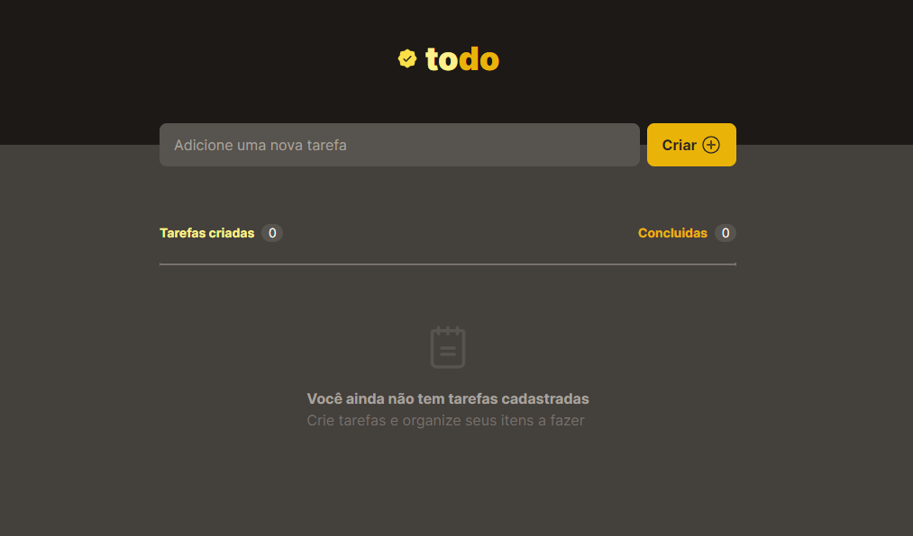
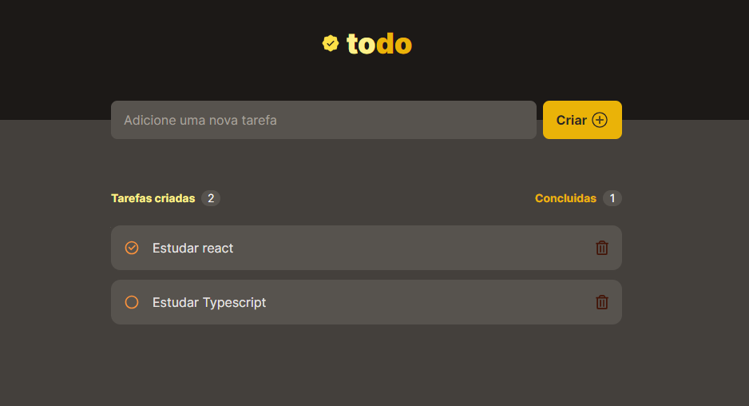

<h1 align="center">To-Do-List App</h1>

 

<a href="https://todo-list-gamma-seven.vercel.app/">👉 DEPLOY</a>

This is a simple To-Do-List application developed with HTML, CSS, and JavaScript. It allows users to interactively create, remove, and view tasks.

## Features

- Dynamic creation and removal of tasks.
- Local storage using localStorage for data persistence between sessions.
- User-friendly interface with interactive checkboxes and icons.

## Technologies Used

- **Vite:** Used for development and bundling.
- **TypeScript:** Provides static typing for a better development experience.
- **React:** JavaScript library for building user interfaces.
- **Styled Components:** CSS-in-JS library for styling React components.
- **ESLint and Prettier:** Linting and code formatting tools to maintain code quality.
- **Tailwind CSS:** Utility-first CSS framework for styling.
- **Phosphor Icons, React Icons:** Libraries for incorporating icons into the application.

## Functionality

The application allows users to add new tasks, mark them as completed through checkboxes, and remove unwanted tasks. Tasks are stored locally, enabling users to maintain their lists even after reloading the page.

## How to Contribute

Contributions are welcome! Feel free to submit pull requests.

## License

This project is licensed under the MIT License - see the `LICENSE` file for details.
